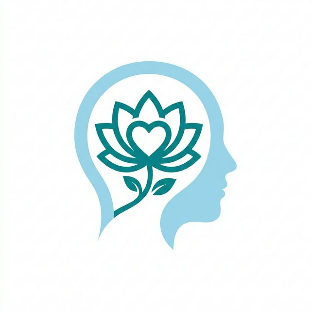

# FoodFetch 
This is a food-related website project managed by Kunal Deo.
This project is under the theme **Healthcare & Food.**

## 📃 Description 
"Welcome to our food delivery website: FoodFetch! Here, you'll find a variety of tools and resources to help you find and order the best food in your city. Our goal is to provide you with a one-stop-shop for all of your food needs. Whether you're looking for a quick break during a hectic workday, or a longer practice to unwind at night, we've got you covered."

## 🕊 Our Tagline 
The one-step solution to get delicious food.
Live a happy life.

## 📝 Table of Contents
- [Services](#services)
- [Logo](#logo)
- [Technology Stack](#tech_stack)
- [Project Admin](#admin)

## 💼 Our Services 
- **Audio Therapy:**
  Relaxing sounds to enjoy while eating. 
- **Reading Therapy:**
  Inspirational quotes and food blogs.
- **Yoga Therapy:**
  Health tips and post-meal yoga.
- **Consult A Doctor:**
  FoodFetch provides you with a list of experienced professionals for health advice. 

## Our Logo 

## Tech Stack 

## 😎 Project Admin 

<table>
  <tr>
<td align="center"><a href="#"> <b>Kunal Deo</b></a></td>
  </tr>
</table>
